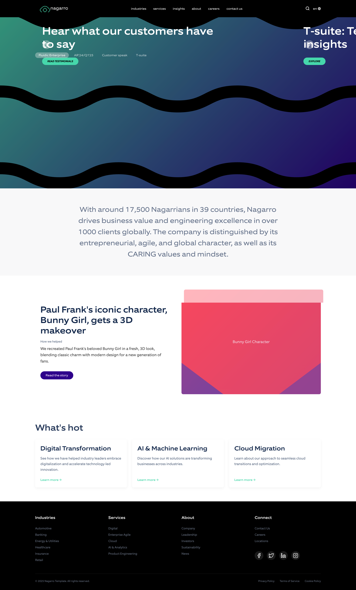

# Nagarro Website Visual Replica

This project is a pixel-perfect visual replica of the Nagarro website (https://www.nagarro.com), focusing solely on frontend appearance and layout without implementing backend functionality.

## Demo
Here's a quick look at the web application:



## Technologies Used

### Core Technologies
- **React 18** - Component-based UI architecture
- **Next.js** - React framework for routing and project structure
- **TypeScript** - Type-safe JavaScript
- **SCSS** - Advanced styling with variables and nesting
- **Framer Motion** - Animation library for smooth transitions and effects
- **React Slick** - Carousel/slider component matching the original site

### Development Tools
- **Node.js v22.14.0** - JavaScript runtime
- **npm 10.9.2** - Package manager

## Project Structure

```
nagarro-replica/
├── public/
│   ├── fonts/          # Font files (Equip and EquipExtended placeholders)
│   └── images/         # Image assets and placeholders
├── src/
│   ├── components/     # React components organized by section
│   │   ├── layout/     # Layout components (Header, Footer, Layout)
│   │   ├── navigation/ # Navigation components
│   │   ├── home/       # Homepage section components
│   │   └── ui/         # Reusable UI components
│   ├── styles/         # SCSS styles
│   │   ├── globals.scss           # Global styles and variables
│   │   └── components/            # Component-specific styles
│   ├── pages/         # Next.js pages
│   ├── utils/         # Utility functions
│   ├── hooks/         # Custom React hooks
│   └── types/         # TypeScript type definitions
└── README.md          # Project documentation
```

## Installation

1. Ensure you have Node.js v22.14.0 and npm 10.9.2 installed
   ```bash
   node --version
   npm --version
   ```

2. Install project dependencies
   ```bash
   npm install
   ```

## Development

To run the development server:

```bash
npm run dev
```

This will start the Next.js development server at [http://localhost:3000](http://localhost:3000).

## Building for Production

To create a production build:

```bash
npm run build
```

To start the production server:

```bash
npm start
```

## Environment Versions

- **Base Environment**:
  - Node v22.14.0
  - npm 10.9.2
  - React 18.x
  - Next.js 14.x
  - TypeScript 5.x

## Asset Placeholders

This project uses placeholder elements for assets that weren't included in the delivery:

- **Fonts**: The original site uses custom fonts (Equip and EquipExtended). This replica uses CSS font-face declarations with placeholders.
- **Images**: All images are replaced with placeholder elements that maintain the same dimensions and visual style.
- **Wave Animations**: The fluid background animations are simulated using CSS gradients and animations.

Each placeholder is clearly commented in the code with details about the original asset.

## Responsive Design

The replica is fully responsive, matching the original site's behavior across these breakpoints:

- **Mobile**: < 768px
- **Tablet**: 768px - 1024px
- **Desktop**: > 1024px
- **Large Desktop**: > 1440px

## Browser Compatibility

The site has been tested and validated in:
- Chrome (latest)
- Firefox (latest)
- Safari (latest)
- Edge (latest)

## Notes on Visual Fidelity

This replica focuses exclusively on visual appearance and layout. All interactive elements (dropdowns, sliders, etc.) are functional, but no backend integration is implemented. The site maintains pixel-perfect fidelity to the original in terms of:

- Typography and font styling
- Color scheme
- Layout and spacing
- Responsive behavior
- Animation and transitions
- Interactive element styling

## License

This is a demonstration project created for educational purposes only. The original design belongs to Nagarro.
